# Conversational AI (Powered by Gemini, ElevenLebs & HeyGen)


**A conversational AI that listens to your voice and responds in a custom-cloned voice, complete with swappable personalities.**

This project is a practical demonstration built as a follow-up to my webinar. It showcases how to integrate several powerful AI services to create a seamless, voice-driven conversational experience with dynamic personas.

---

## ✨ Features

* 🎙️ **Real-time Voice Input:** Actively listens for user questions via the microphone.
* ✍️ **High-Accuracy Transcription:** Utilizes **Azure Cognitive Services** for precise speech-to-text conversion.
* 🧠 **Intelligent Response Generation:** Leverages the **Google Gemini API** to provide context-aware and coherent answers.
* 🗣️ **Custom Voice Output:** Converts text responses back into speech using a unique, cloned voice from **ElevenLabs**.
* 🎭 **Dynamic Personas:** Easily load different personalities for the bot from simple text files at runtime.

---

## ⚙️ How It Works

The application initializes by loading a persona, then enters a loop to process voice commands and generate a spoken response.

```mermaid
graph TD
    A[Start Application] --> B{Load Persona File};
    B --> C[🎙️ User Speaks];
    C -->|Microphone Input| D(Azure Speech-to-Text);
    D -->|Transcribed Text| E{Google Gemini API};
    E -->|Generated Answer| F(ElevenLabs Text-to-Speech);
    F -->|Audio Stream| G[🔊 Bot Responds];
    G --> C;
```



---

## 📂 Project Structure

Your project should be organized with the following directory structure:

```
/your-project-root
|
|-- /personas
|   |-- bob.txt
|   `-- sally.txt
|
|-- gui.py
|-- requirements.txt
`-- .env
```

---

## 🛠️ Tech Stack

This project is built with a modern, AI-focused stack:

| Technology                                                                                                | Purpose                  |
| --------------------------------------------------------------------------------------------------------- | ------------------------ |
|       | Core Application Logic   |
|  | Speech-to-Text           |
|   | AI Language Model        |
|  | Custom Voice Synthesis   |

---

## 🚀 Getting Started

Follow these steps to get the project running on your local machine.

### Prerequisites

Before you begin, ensure you have the following:

* **Python 3.8 or newer** installed on your system.
* **API Keys** for:
    * Azure Cognitive Services
    * Google AI Studio (for the Gemini API)
    * ElevenLabs (including a Voice ID for your cloned voice)
* **Git** installed to clone the repository.

### Installation & Setup

1.  **Clone the repository:**
    ```bash
    git clone [https://github.com/adamfebery/conversational-ai.git](https://github.com/adamfebery/conversational-ai)
    cd conversational ai
    ```

2.  **Set up a virtual environment (Recommended):**
    ```bash
    python -m venv venv
    source venv/bin/activate  # On Windows, use `venv\Scripts\activate`
    ```

3.  **Install dependencies:**
    ```bash
    pip install -r requirements.txt
    ```

4.  **Configure your environment variables:**
    Create a file named `.env` in the project root. Copy the structure below and add your secret API keys and configuration details.

    ```dotenv
    # Azure Cognitive Services
    AZURE_SPEECH_KEY=YOUR_AZURE_API_KEY
    AZURE_SPEECH_REGION=YOUR_AZURE_REGION

    # Google Gemini
    GEMINI_API_KEY=YOUR_GEMINI_API_KEY

    # ElevenLabs
    ELEVENLABS_API_KEY=YOUR_ELEVENLABS_API_KEY
    ELEVENLABS_VOICE_ID=YOUR_CLONED_VOICE_ID
    ```

5.  **Create your persona files:**
    Create a directory named `personas` in your project root. Inside this directory, create `.txt` files for each persona you want. For example, create `personas/bob.txt`:

    ```txt
    You are Bob, a friendly and slightly sarcastic assistant from Liverpool. You love talking about football and the weather. Keep your answers brief and witty.
    ```

### Running the Application

Run the `gui.py` script from your terminal

```bash
# Example: Run the bot 
python gui.py
```

The application will start and prompt you to pick a persona and start your session.

---

## 🤝 Contributing

Contributions are welcome! If you have ideas for improvements or want to fix a bug, please feel free to:

1.  Fork the repository.
2.  Create a new branch (`git checkout -b feature/YourAmazingFeature`).
3.  Commit your changes (`git commit -m 'Add some AmazingFeature'`).
4.  Push to the branch (`git push origin feature/YourAmazingFeature`).
5.  Open a Pull Request.

Please make sure your code adheres to the project's coding standards.
